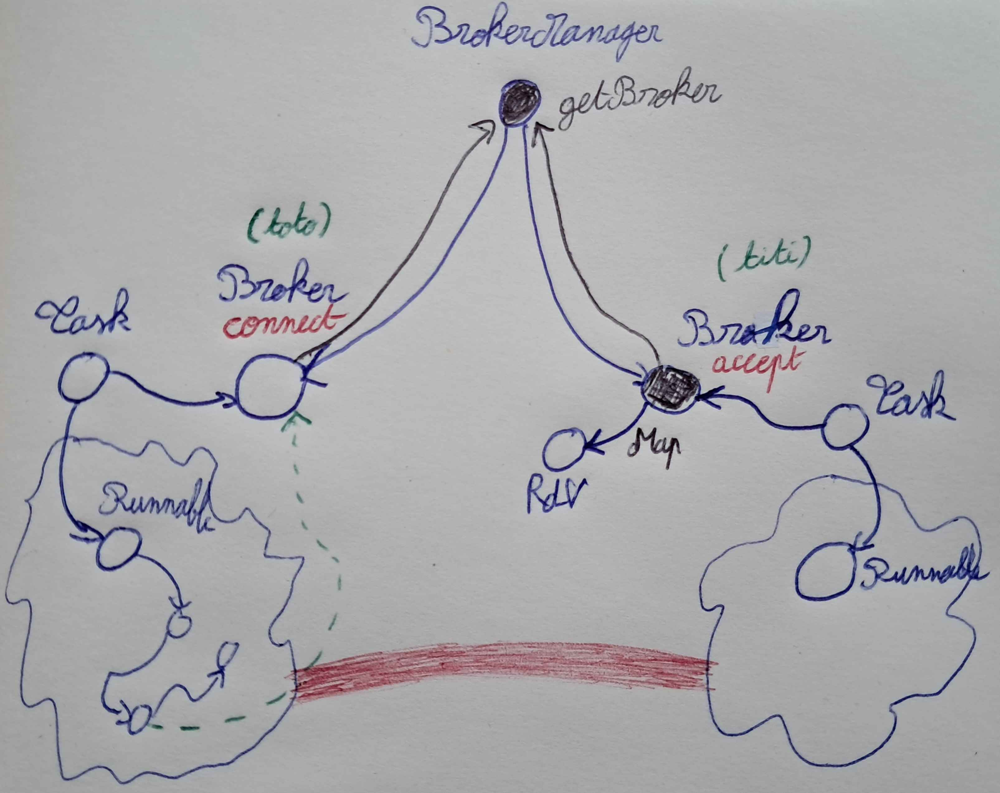
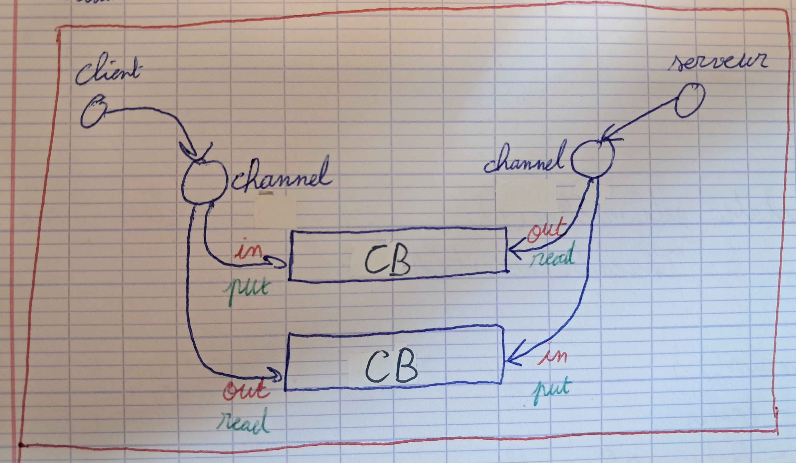

# Design du système de communication

Ce fichier présente le design choisi pour le système de communication.

## Diagramme de classes

Comme vu dans la spécification, une tâche est liée à un broker.  
Pour établir une communication entre 2 tâches, l'ajout d'un **BrokerManager** permet d'obtenir le broker d'une tâche sans devoir posséder une référence à travers les méthodes.  
En plus, une classe **RdV** permet de créer un système de rendez-vous afin qu'un canal communique bien entre 2 brokers.
Le diagramme suivant design alors le système de communication :  



## Utilisation du buffer et communication full-duplex

Lors de la connexion entre 2 brokers, le canal de communication est retourné par le *"accept"* et par le *"connect"*. Afin d'avoir une communication full-duplex sans perturber le flux d'octets, le canal possède 2 **CircularBuffer**. Le buffer *in* permet d'écrire des octets d'un côté qui seront lus par l'autre côté et vice-versa.
Le diagramme suivant représente le système de communication en utilisant les CircularBuffer au sein des canaux :  



## Déconnexion

Pour gérer la déconnexion, lorsqu'un côté se déconnecte, le message **"disconnect"** est envoyé dans le canal pour indiquer à l'autre partie la déconnexion ; entre autres, cela permet d'éventuellement finir la lecture d'un buffer après même la déconnexion de l'autre partie.  
La déconnexion possède une garde sur le flag **disconnected** afin de palier aux problèmes de concurrence.


## Design des classes et méthodes

Pour résumer les points précédents, le code suivant reprend les aspects principaux :

- Afin d'avoir une communication full-duplex, 2 canaux seront donc attendus par la classe **Channel** :
```java
class Channel {
    CircularBuffer in; // Buffer to write
    CircularBuffer out; // Buffer to read

    // ...
}
```

- Le **BrokerManager** possèdera des méthodes statiques afin de substituer le passage par référence des brokers dans le code :
```java
class BrokerManager {
    static BrokerManager buff; // Static manager to get all the local brokers
    static BrokerManager getBuff();// Static method to get the buffer

    // ...
}
```

- La classe **RdV** permet d'attendre les 2 brokers de communication et assure la communication d'uniquement 2 brokers sur un même canal, d'où :
```java
class RdV {
    Broker ba; // Accepting broker
    Broker bc; // Connecting broker
    int port; // Communication port

    Channel connect(Broker b); // Broker wanted a connection
    Channel accept(Broker b, int port); // Broker expected a connection

    // ...
}
```
