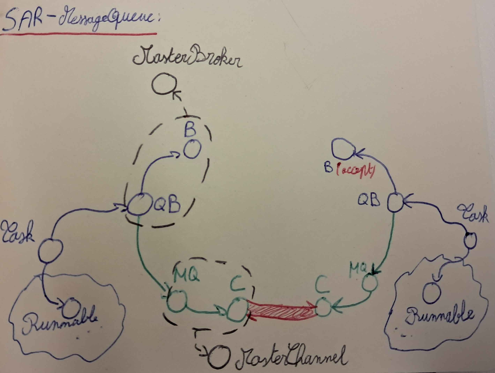

# Design du système de communication

Ce fichier présente le design choisi pour les queues.

## Diagramme de classes

Une task est désormais liée à un queuebroker, lui-même lié à un broker.  
Pour simplifier cela, une nouvelle classe abstraite **MasterBroker** permet de généraliser les brokers "en général".  
De même, pour les messagequeues et les channels, une classe abstraite **MasterChannel** permet de généraliser les classes.  

Le nouveau système de communication avec les queues est une sur-couche des brokers et channels.  
Désormais, c'est l'application qui s'occupera d'envoyer les paquets de l'utilisateur qui correspondront à un flux d'octets. Le flux sera préfixé de 4 octets qui indiquent la taille du paquet global qui circulera ensuite sous forme de flux d'octets. 
Le diagramme suivant design alors le système de communication :  



## Design des classes et méthodes

Pour résumer les points précédents, le code suivant reprend les aspects principaux :

- pour la classe MasterBroker :
```java
public abstract class MasterBroker {
    public String name;

    public abstract MasterChannel accept(int port);
    public abstract MasterChannel connect(String name, int port);
}
```

- pour la classe MasterChannel :
```java
public abstract class MasterChannel {
    // For Channel
    public abstract int read(byte[] bytes, int offset, int length);
    public abstract int write(byte[] bytes, int offset, int length);
    void disconnect();
    boolean disconnected();

    // For MessageQueue
    void send(byte[] bytes, int offset, int length);
    byte[] receive();
    void close();
    boolean closed();
}
```

