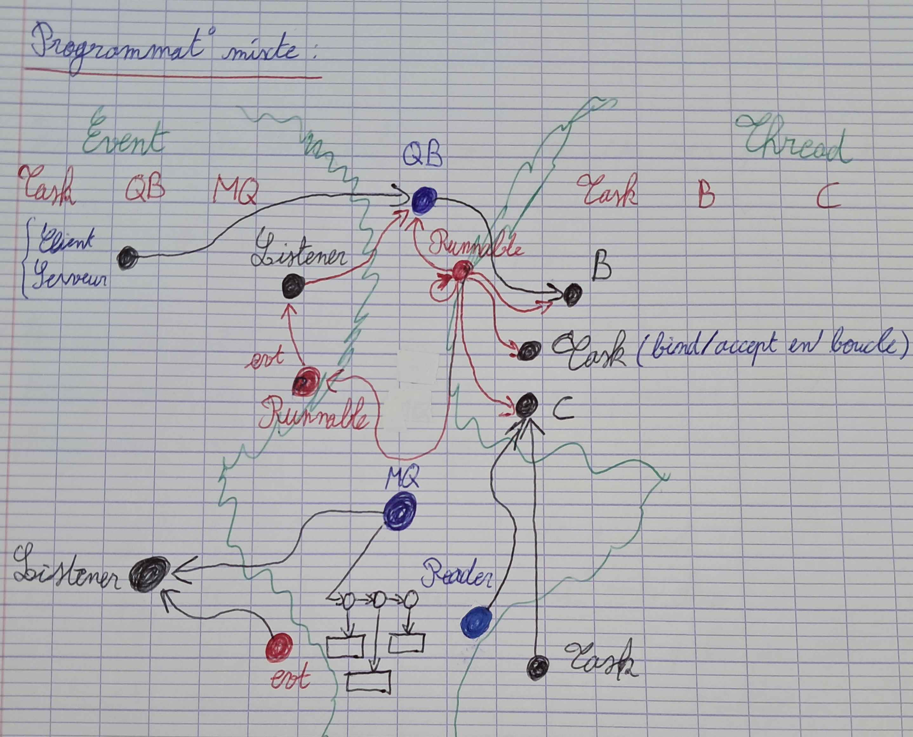
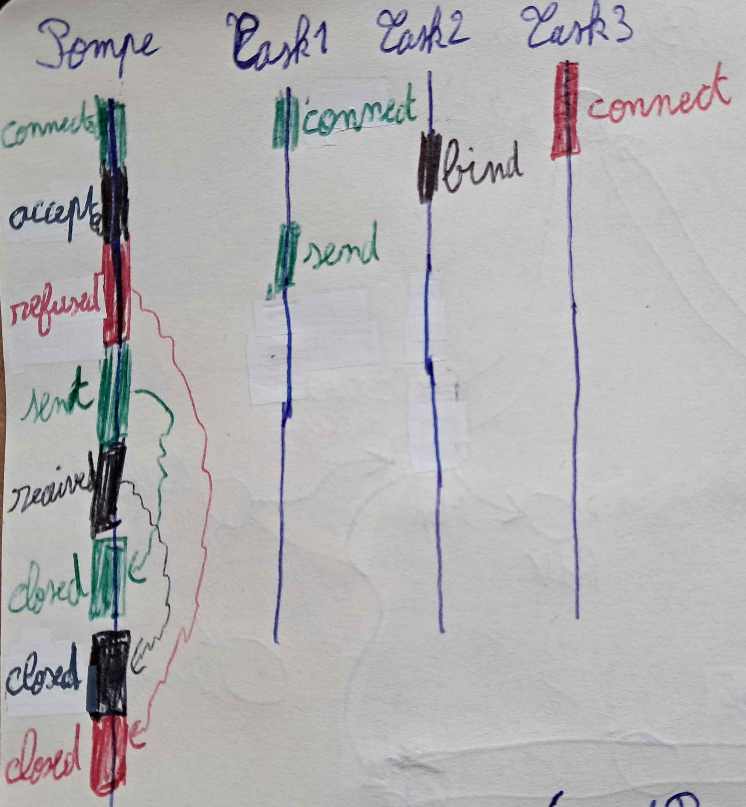

# Programmation mixte

Ce fichier décrit le design du fonctionnement interne choisi pour la gestion des événements et du multi-threadé.

## Task

Une task permet d'ajouter les actions des événements à la pompe avec la méthode *post*. Cette méthode alors permet d'effectuer l'action liée à l'événement de manière asynchrone.  

### TODO
On peut obtenir la task courante avec la méthode *task*.  // TODO: à revoir
Une task peut être tuée avec la méthode *kill* et on peut connaître son statut via *killed*. // TODO: à revoir

## EventPump

La pompe à événement est une **EventPump** qui s'exécute donc sur un seul thread.  
La méthode *run* lance les événements stockés dans la file de la pompe. Cette action a, au préalable, été rajoutée à la pompe via la méthode *post* de la task qui appelle la méthode *post* de la pompe.

## Message

Pour éviter de créer des confusions, on simplifie l'envoi de messages avec la classe *Message* qui correspond alors à un tableau de bytes, un offset et une taille. Cela permet entre autres de faire une copie du tableau de message initial afin qu'il ne subisse pas de modifications si le remote le modifie après l'envoi.

## Diagramme de classes

Le diagramme de classes suivant illustre le design pour le système entre événement et threads :  

## Pompe à événements

Le système possède une pompe à événements qui permet de gérer les événements des méthodes de l'API alors non bloquantes.  
Le schéma suivant décrit le fonctionnement de la pompe à événements avec un écho serveur (task 1 et 2 pour le client et le serveur) et une autre refusée :  

